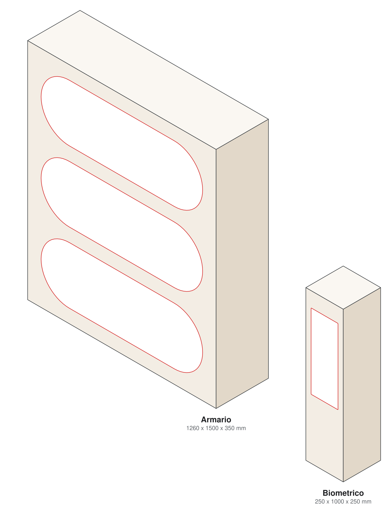
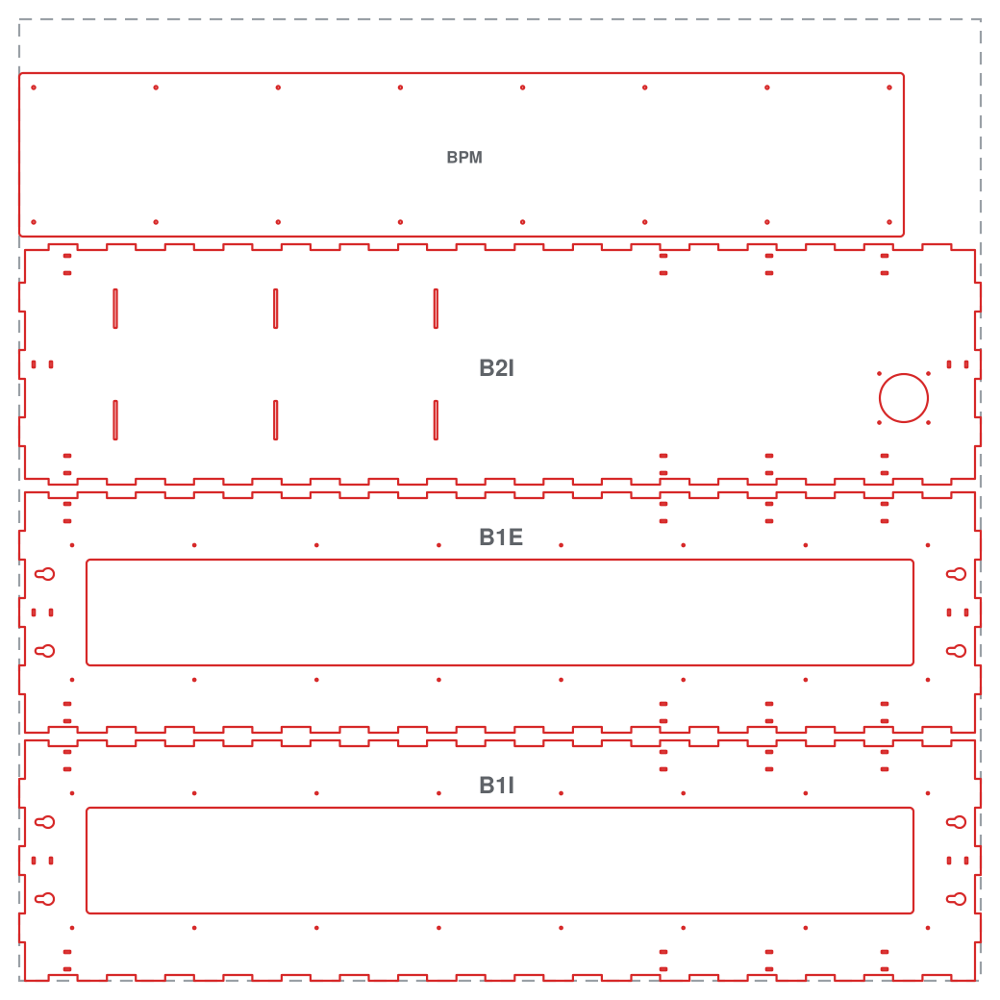
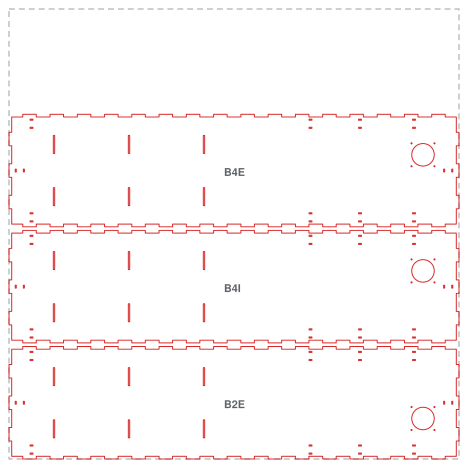
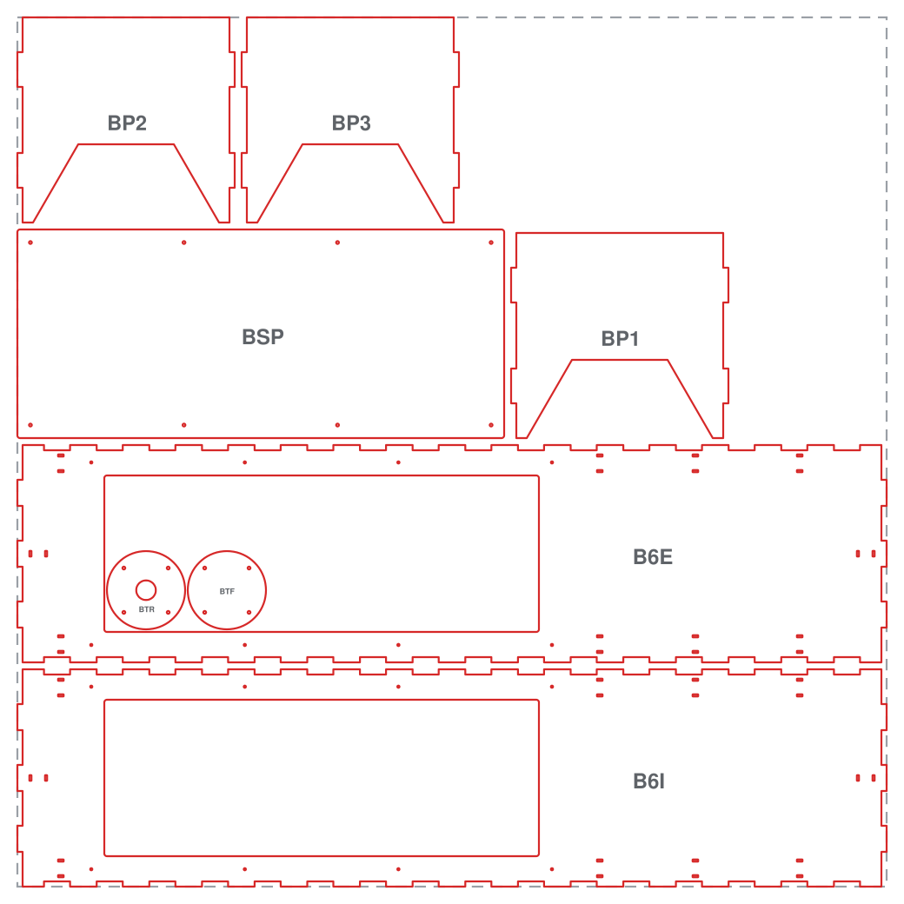
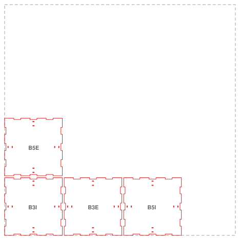
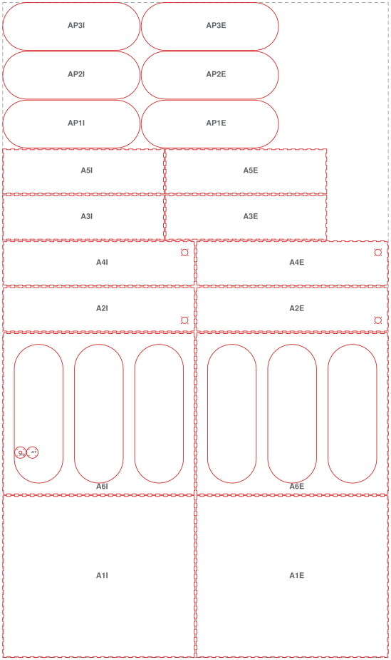

# Dispensário eletrônico · módulos em MDF

Chassi do protótipo do dispensário eletrônico da disciplina de Projeto de Sistemas Embarcados. São dois módulos de MDF cortado a laser, e cada painel é um sanduíche de duas lâminas de 3 mm. Nada aqui foi desenhado à mão: as medidas moram em [`specs/modulos.json`](specs/modulos.json), o [`gerador.py`](gerador.py) desenha, confere e exporta.

A linguagem construtiva (enforca-gato, dedos, camada dupla, gota de parede, pílula) está documentada no repositório irmão, **[dispensario-design-system](https://github.com/joshazze/dispensario-design-system)**.

<p align="center"></p>

## Estado

| módulo | medida externa (L x A x P) | peças | situação |
|---|---|---|---|
| Biométrico, código `B` | 250 x 1000 x 250 mm | 19 | **pronto para a máquina**, em 4 cargas de até 1000 x 1000 mm |
| Armário, código `A` | 1260 x 1500 x 350 mm | 20 | **rascunho**: 12 painéis são maiores que a mesa |

Já cortadas em 03/09/2026: `BP1`, `BP2`, `BP3`, `BSP`, `B3E`, `B5E`, `BTR` e `BTF`.

Máquina de referência: eCNC L-1210, mesa de 1150 x 1000 mm. Cada carga usa no máximo 1000 mm de largura, folga entre peças incluída, e os 150 mm que sobram ficam de margem.

## Arquivos de corte

```
cortes/
├── biometrico/
│   ├── modulo-biometrico-bloco1.dxf   ← carga 1 da máquina (e .pdf, .svg)
│   ├── modulo-biometrico-bloco2.dxf
│   ├── modulo-biometrico-bloco3.dxf
│   ├── modulo-biometrico-bloco4.dxf
│   └── modulo-biometrico.dxf          ← as 19 peças numa prancha só
└── armario/
    └── modulo-armario.dxf             ← prancha de conferência, ainda não cortável
```

Para a máquina vai o `.dxf`. O `.pdf` tem a mesma prancha em escala 1:1 para conferir na tela ou imprimir, e o `.svg` é o mesmo desenho em vetor.

Todo DXF sai no perfil que o técnico do laboratório usa: AutoCAD 2018 (AC1032), unidade em milímetro, camada `CORTE` na cor 1 (vermelho), contornos em `LWPOLYLINE` e `CIRCLE`, sem moldura da mesa e com o ponto mais baixo à esquerda em (0, 0). Os furos e recortes vêm antes do contorno externo de cada peça: cortado o perímetro, a peça se solta e o furo sairia torto.

### As quatro cargas do biométrico

| carga | área ocupada | peças |
|---|---|---|
| 1 | 1000 x 944 mm | `B1I`, `B1E`, `B2I`, `BPM` |
| 2 | 1000 x 766 mm | `B2E`, `B4I`, `B4E` |
| 3 | 1000 x 1000 mm | `B6I`, `B6E`, `BP1`, `BP2`, `BP3`, `BSP`, `BTR`, `BTF` |
| 4 | 766 x 508 mm | `B3I`, `B3E`, `B5I`, `B5E` |

As tampas `BTR` e `BTF` saem de dentro da janela da frente `B6E`: aquele MDF já estava pago.

<table>
<tr>
<td width="50%"><br><sub>Carga 1</sub></td>
<td width="50%"><br><sub>Carga 2</sub></td>
</tr>
<tr>
<td><br><sub>Carga 3</sub></td>
<td><br><sub>Carga 4</sub></td>
</tr>
</table>

Na prancha as peças retangulares ficam sempre **deitadas**, com o lado maior na horizontal. Um painel de 250 x 1000 que fica em pé no módulo aparece girado 90° no desenho, e o rasgo que é vertical na montagem aparece horizontal aqui.

## Como ler os códigos

Cada lâmina tem um código de três partes: **módulo**, **face** e **lâmina**. `B6E` é a lâmina externa da frente do biométrico.

| módulo | face | lâmina |
|---|---|---|
| `B` biométrico | `1` fundo (lado da parede) | `I` interna |
| `A` armário | `2` lateral esquerda | `E` externa |
| | `3` piso | |
| | `4` lateral direita | |
| | `5` teto | |
| | `6` frente | |

Peças avulsas levam três letras:

| código | peça | medida | lâminas |
|---|---|---|---|
| `BSP` | sub-painel da interface, atrás da janela da frente | 240 x 560 mm, 8 parafusos | 1 |
| `BPM` | placa que fecha o vão de manutenção do fundo | 170 x 920 mm, 16 parafusos | 1 |
| `BP1` a `BP3` | prateleiras em U com abas nas laterais | 250 x 236 mm | 1 |
| `BTR`, `ATR` | tampa do passa-fio com furo para prensa-cabo PG16 | ⌀90 mm, furo ⌀22,5 | 1 |
| `BTF`, `ATF` | tampa cega do passa-fio | ⌀90 mm | 1 |
| `AP1` a `AP3` | folhas da porta do armário, em pílula | 1072 x 372 mm | 2 |

### O que cada face do biométrico leva

| face | feições |
|---|---|
| 1 fundo | vão de manutenção 110 x 860, 16 furos da placa `BPM`, 4 gotas de parede, enforca-gato |
| 2 e 4 laterais | passa-fio ⌀50 com 4 furos da tampa, 3 pares de rasgos de prateleira, enforca-gato |
| 3 piso e 5 teto | 4 duplas de enforca-gato, uma virada para cada parede |
| 6 frente | janela da interface 180 x 500, 8 furos do sub-painel `BSP`, enforca-gato |

Cada feição está explicada, com medida e regra, no [design system](https://github.com/joshazze/dispensario-design-system).

## Armário

<p align="center"></p>

A porta são três pílulas deitadas de 1080 x 380 mm na frente, cada uma com a folha própria (`AP1` a `AP3`) 4 mm menor por lado. Nesta figura o painel da frente está girado, por isso as pílulas aparecem em pé. As laterais levam o passa-fio igual ao do biométrico.

O armário ainda não é cortável: os painéis de 1260 x 1500 não entram na mesa de 1150 x 1000, e as folhas da porta, com 1072 mm, passam da carga de 1000 mm. Nada disso fica escondido: cada peça dessas ganha uma carga própria marcada como `FORA DE MEDIDA`.

## Gerar de novo

Requisitos: Python 3.10 ou mais novo, sem biblioteca externa. O PDF usa o Google Chrome ou Chromium; sem ele, o gerador avisa e pula só o PDF (dá para apontar o caminho com `CHROME=...`).

```bash
python3 gerador.py --filtro '^B' --nome biometrico/modulo-biometrico
python3 gerador.py --filtro '^A' --nome armario/modulo-armario
python3 previas.py        # figuras deste README
```

Para mudar uma medida, edite `specs/modulos.json` e rode o gerador de novo. Ele imprime o tamanho de cada carga, o aproveitamento do material, a tabela de peças contra a mesa e, se houver, cada problema de fabricação encontrado.

`--filtro` é uma expressão regular sobre o código da peça (`'^B6'` pega só a frente do biométrico) e `--nome` escolhe pasta e nome dentro de `cortes/`.

### Testes

```bash
python3 -m pip install -r requirements-dev.txt
python3 -m pytest
```

São 23 testes. Entre outras coisas, eles garantem que:

* cada painel tem duas lâminas de 3 mm e a junta de dedos tem 6 mm de profundidade;
* nenhuma peça invade outra na prancha e toda feição fica dentro da peça, longe da borda;
* a fenda de toda gota de parede aponta para cima e nenhuma gota fica debaixo da placa `BPM`;
* nas quatro paredes do biométrico, o rasgo de enforca-gato fica a pelo menos 9 mm (3x a espessura) de qualquer outra feição;
* a aba da prateleira bate com o rasgo da lateral;
* o vão da porta sai com uma linha de corte só;
* nenhuma carga do biométrico passa de 1000 mm de largura;
* o DXF sai sem moldura, com o canto de baixo à esquerda na origem.

## Pendências

* **Kerf e espessura são estimativa.** O kerf de 0,18 mm e a espessura de 3,00 mm do MDF ainda não foram medidos, e a compensação de kerf está desligada. Falta cortar um cupom de calibração e medir com paquímetro.
* **Armário não cabe na mesa.** Sai por emenda dos painéis ou por uma altura menor.
* **Frente do armário:** visor, dobradiça e tranca ainda não estão no desenho.
* **Frente do biométrico:** as aberturas da eletrônica dependem dos componentes escolhidos.

## Estrutura

| caminho | o que é |
|---|---|
| `specs/modulos.json` | todas as medidas, em mm |
| `gerador.py` | desenha faces, feições e peças avulsas, encaixa nas cargas e exporta |
| `previas.py` | figuras do README |
| `laser/` | geometria, escritor de DXF, relatório e registro de material |
| `perfis/` | modelo de DXF do técnico e o perfil extraído dele |
| `materiais.json` | kerf e espessura por material, marcados como `estimado` ou `medido` |
| `third_party/tabbedboxmaker/` | matriz de juntas de dedos das seis faces |
| `tests/` | validação automática |

## Licença

© 2026 Joshua Azze Distel. Código e desenhos sob a [GNU GPL v2](LICENSE), porque o gerador usa o [TabbedBoxMaker](https://github.com/paulh-rnd/TabbedBoxMaker), que é GPL v2 e está preservado em `third_party/tabbedboxmaker/`.
